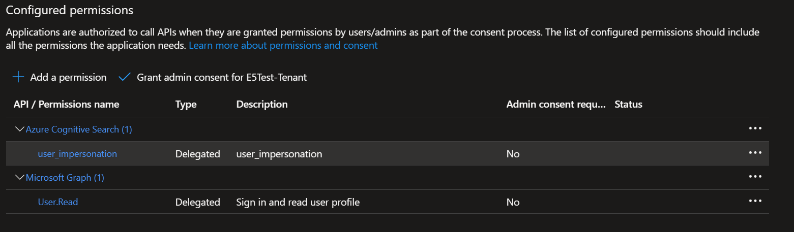

# OpenAIPlayground

## Requirements

1. Search Service is already setup
2. Demo hotel data is already imported
3. App is registered in AAD tenant
4. Role is created in Entra
5. User has role

## Hosting on developer machine

1. Clone to your machine
2. dotnet restore
3. Change appsetting.json (accodingly to your app ID)
4. dotnet run

## Hosting on developer static web app in Azure

1. Fork to your repository
2. Deploy a static web app https://learn.microsoft.com/en-us/azure/static-web-apps/deploy-blazor

## App registration
Permission for Search 

The client as SPA

## Roles
In order to restrict users to an specific index I use roles of Entra ID. 